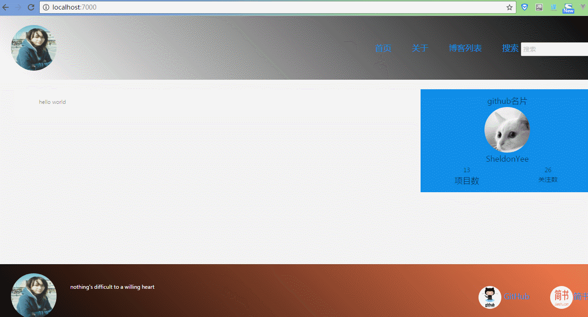

# pure-node-notebook(纯Node记事本)

<h2>项目目的:深入学习Node，和熟悉后端服务端工作流程。</h2>
<p>要强调的是，这个项目主要是用来学习node.js的，是用来疏通又前端到后端总体运作，加载自己在未来对项目的理解，加强自己对项目的把控力，因此前端页面是相对比较不太完善，但是node服务端的主要功能，CRUD的数据库操作，static中间件处理静态资源，api中间件处理ajax请求，parser中间件处理post的请求等等在日常项目中用到的中间件都涉及到</p>

<h2>项目介绍</h2>
<p>主要介绍node.js服务端，整个后端逻辑主要借鉴了koa的风格，实现流式中间件(这个要感谢晓刚先生的指导),而整个后端需要5个中间件，都是自行编写的，包括处理静态资源的static-server，处理ajax的api-server，处理post请求的url-parser，处理服务端渲染和重定向的view-server，最后是处理服务器和客户端之间的session的cookie-parser。而数据库选择了MongoDB，使用mongoose进行操作，前端使用了react+ant.design做视图层面的开发</p>      


<h2>技术栈</h2>

<h5>webpck : 自动化构建工具</h5>

<h5>babel ： 处理前端的ES6代码</h5>

<h5>ejs : ejs相对jade非常友好，因此选ejs作为模板语言用来做首屏渲染和SEO(搜索引擎优化)</h5>

<h5>es6: 采取ES6语法,由于chrome的V8引擎几乎完美支持ES6和部分ES7，因此在写Node的时候绝大部分采取ES6风格代码</h5>

<h5>react ：优秀前端框架</h5>

<h5>ant.design ： 优秀react UI库</h5>

<h5>SCSS : css预处理语言处理前端样式</h5>

<h5>MongoDB : 非关系数据库</h5>

<h5>Mongoose : MongoDB的ORM，方便対数据库的CURD的操作</h5>

---------------------------------------------------------------------------------------------------------------------------

<h2>效果图</h2>



<p>由于项目没有使用类似express和koa等node的web服务器框架，而且所有中间件都是根据实际需求自行编写的.</p>

<h2>介绍中间件:</h2>
1.static-server：主要是处理img，css，js等静态资源，整个中间遵循Promise风格，因为在主程输入口，被编写为类koa的风格

2.api-server:处理前端发送过来ajax请求，当前端将请求发送过来，通过报文的主要信息使用mongoose这个Promise风格的库操作mongoDB数据库，然后返回数据

3.cookie-parser:由于HTTP协议是无状态协议，当我们需要和客户端进行session的时候，我们需要cookie帮助我们保存状态，因此这个中间件，通过设置白名单机制来控制登录处理，用HttpOnly来方式XSS脚本注入攻击，用max-age来规定cookie保存时间

4.url-parser:这个中间件是用来处理前端通过post请求，通过流的方式，取得post请求的数据，然后将数据送到api-server中间件进行数据库处理

5.view-server:这个中间件主要负责服务端渲染，使用ejs模板语言根据URI来做出不同渲染，而且还处理了重定向的问题

```
步骤:
1.先安装mongoDB数据库

2.git clone git@github.com:PeterCheng1/pure-node-note-book.git

3.npm install

4.sh ./db.sh （启动mongoDB服务）

5. 进到public目录 ==> npm start (编译前端代码)

6. 在node启动目录，npm start 启动服务器 localhost:7000

```

<h2>遇到问题:</h2>
由于到mongoDB理解的不是特别深，而且由于mongoose文档确实有点不友好，因此在编写操作数据库逻辑，存在不少困难，因此还存在一些blog还没有修复
